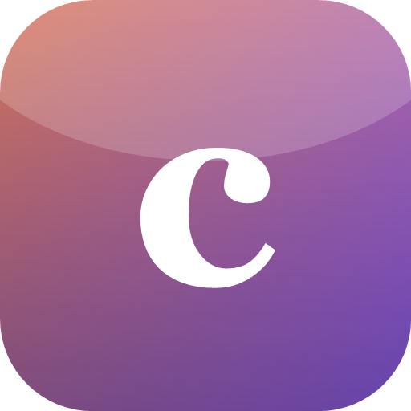

  

<h1 align="center">clop</h1>

  <b>Agentic IDE with your own AI provider — liquid glass design, local agents, 100+ integrations</b> 
  Агентная IDE со своим ИИ-провайдером: Claude Code, OpenAI-совместимые API и локальные модели Ollama

---

## Установка / Install

Скачай и запусти **[clop Setup 2.1.0.exe](clop%20Setup%202.1.0.exe)** — или возьми свежую версию в [Releases](../../releases).

## Возможности / Features

- **Чат как в Claude** — полноэкранный чат, боковая панель с историей, дизайн «жидкое стекло» с анимированным фоном
- **Свой ИИ на выбор**:
  - **Claude Code** (работает твоя подписка) с выбором модели: Fable 5, Opus 5, Sonnet 5, Haiku 4.5 и др.
  - любой **OpenAI-совместимый API** (OpenAI, OpenRouter, свой прокси) с уровнем раздумий
  - **локальные модели через Ollama** — без API-ключа
- **Настоящий агент** — живой поток раздумий как в Claude Code, лог действий с временем и токенами, кнопка «Стоп», очередь сообщений, параллельные чаты
- **IDE-панель** — дерево файлов, редактор с вкладками, встроенный терминал PowerShell, вкладка Git (статус, дифф, коммит в один клик)
- **Артефакты** — созданные агентом файлы с живым предпросмотром HTML/картинок и историей версий с откатом
- **Агент задаёт вопросы** — карточки с кнопками вариантов прямо в чате
- **Источники** — просмотренные агентом веб-страницы кликабельны под ответом
- **100+ интеграций (MCP)** — GitHub, Notion, Slack, Stripe, Postgres, Figma, Playwright и десятки других; тысячи приложений через Zapier / Composio / Pipedream; любой свой MCP-сервер
- **Уровни разрешений** — авто / по разрешениям / всё разрешено
- **50 языков интерфейса**, английский по умолчанию
- Чаты и настройки переживают обновления (автобэкап)

## Стек

Electron · NSIS installer · Windows 10/11
